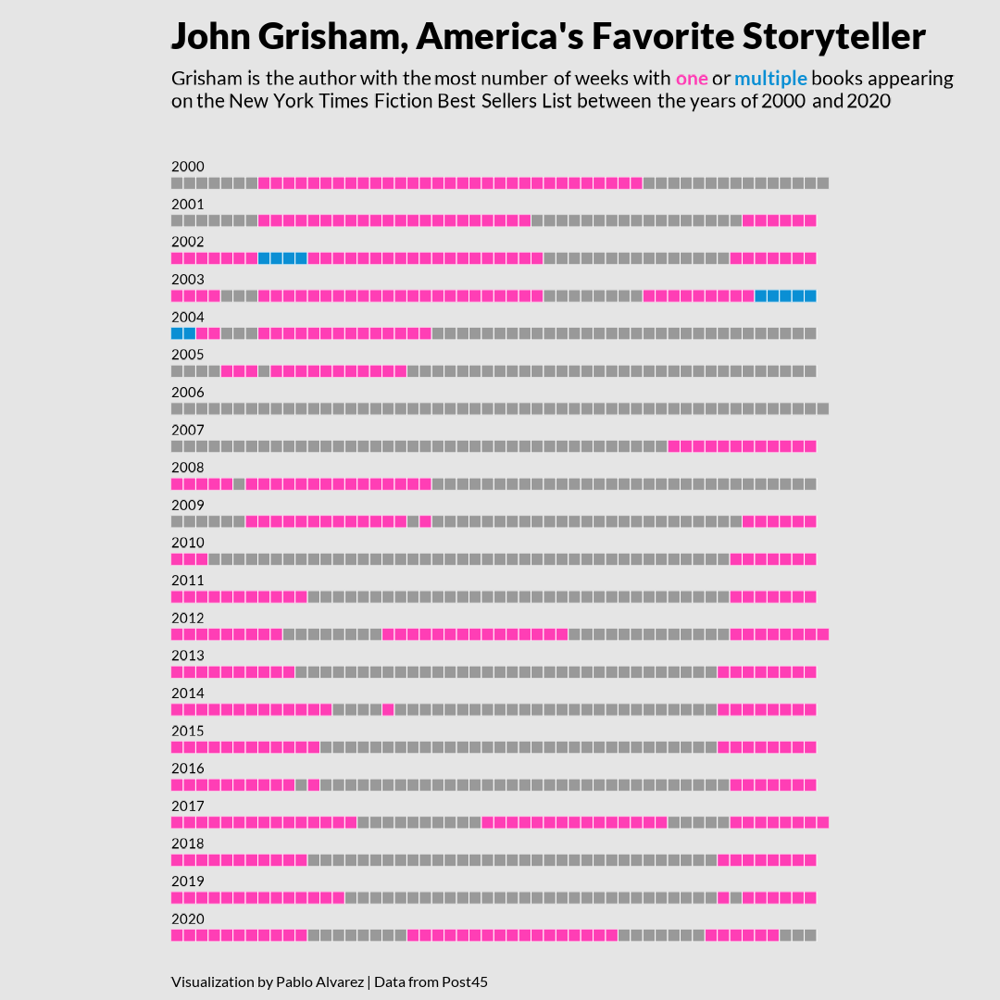

<h1 style="font-weight:normal" align="center">
  &nbsp;#TidyTuesday&nbsp;
</h1>

     
      Let's connect!
      
      
&nbsp;&nbsp;&nbsp;
&nbsp;&nbsp;&nbsp; 
&nbsp;&nbsp;&nbsp;
&nbsp;&nbsp;&nbsp;
&nbsp;&nbsp;&nbsp;
 
 
 

   

   

 Contributions in chronological order
  

  ## 2022
  #### [2022/20_eurovision](2022/20_eurovision/)
  
  
  #### [2022/19_nytimes_best_sellers](2022/19_NYTimes_best_sellers/)
  

